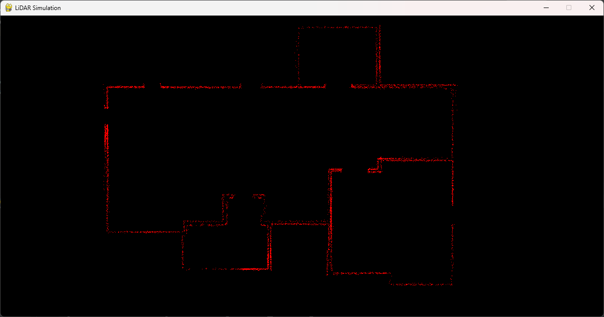

# LiDAR_simulation 

This project implements a simple LiDAR (Light Detection and Ranging) simulation using Python and Pygame. LiDAR is a remote sensing method that uses light in the form of a pulsed laser to measure distances to objects. In this simulation, the LiDAR sensor emits laser beams and detects obstacles in its path.

## Features

- Simulated LiDAR sensor with adjustable range and uncertainty.
- Environment with an external map loaded from an image file.
- Real-time visualization of sensed obstacles.

## Installation

1. Clone the repository:

```bash
git clone https://github.com/Varun-Ajith/LiDAR-simulation.git
```
2. Install the required dependencies: `pip install pygame numpy`

## Usage

1. Run the main.py file: `python main.py`
2. Use the mouse to control the LiDAR sensor. Move the mouse cursor to change the sensor position, and observe how the sensor detects obstacles in its path.

## Files

- `main.py`: The main script to run the LiDAR simulation.
- `env.py`: Defines the environment and methods for visualizing sensor data.
- `sensor.py`: Implements the LiDAR sensor and obstacle detection logic.



## Contributing
Contributions are welcome! If you have any ideas for improvements or new features, feel free to open an issue or submit a pull request.

## License
This project is licensed under the MIT License - see the LICENSE file for details.
